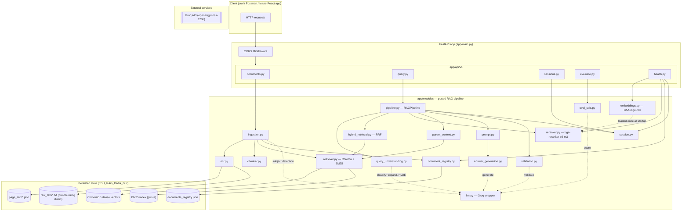

# Multilingual RAG System for Bengali Educational Content — Bangla + English

A production-quality **Retrieval-Augmented Generation (RAG)** service for Bangla
educational content — literature, stories, poetry, novels, history, sociology,
science, and general education — with full support for English and mixed
Bangla-English queries. Built with **FastAPI**, backed by **ChromaDB** (dense) +
**BM25** (sparse) hybrid retrieval, a **cross-encoder reranker**, and **Groq** for
fast LLM inference.

## Project Overview

You upload a PDF — any Bangla educational document, any subject, any genre, any
type (born-digital or scanned) — and the service OCRs it, structures it,
chunks it, embeds it, and indexes it. You then ask questions about it, in
Bangla, English, or mixed, and get back grounded answers with the exact
excerpts they came from, a confidence/validation verdict, and the running
conversation history if you're in a multi-turn session.

Nothing here is a toy demo. Every stage — OCR, chunking, embeddings, hybrid
retrieval, reranking, parent-context expansion, query understanding, answer
generation, validation, session memory, evaluation — is a real, working
component, ported from a validated research notebook, with the same design
decisions and the same cost-control strategy intact.

## Objective & Features

**Objective:** give students, teachers, and self-learners a way to ask real
questions against real Bangla educational material and get answers that are
*grounded in the source text*, not hallucinated — including questions whose
answers require connecting multiple paragraphs (multi-hop reasoning), not
just simple lookups.

**What it does, and how:**

- **Ingests any PDF, page by page.** Uses Tesseract OCR (`pytesseract` +
  `pdf2image`) with OpenCV preprocessing (deskew via `minAreaRect`, denoise via
  `fastNlMeansDenoising`, adaptive Otsu thresholding) so it works on both
  scanned books and born-digital PDFs — never loading more than one page's
  image into memory at a time.
- **Detects the subject automatically.** A small Groq call reads a sample of
  the extracted text and labels the document's domain (History, Bangla
  Literature, Science, Sociology, ...) — nothing is hardcoded to any specific
  genre or book.
- **Structures text into a real hierarchy.** Regex-based chapter/heading
  detection (tuned for Bangla — `অধ্যায়়`, `পরিচ্ছেদ` — and English `chapter`
  markers) builds a Book → Chapter → Heading → Paragraph structure before
  chunking.
- **Chunks semantically, not blindly.** 350–700 token chunks with ~10% overlap,
  built by greedily merging whole paragraphs — never splitting one mid-sentence
  unless a single paragraph alone exceeds the max budget.
- **Embeds with a real multilingual model.** `BAAI/bge-m3` via
  `sentence-transformers`, indexed in a persistent **ChromaDB** collection.
- **Retrieves with both dense and sparse signals.** ChromaDB (semantic
  similarity) and BM25 (exact keyword/entity matching) run in parallel and are
  fused with **Reciprocal Rank Fusion (RRF)** — a scale-free way to combine two
  very different scoring systems.
- **Reranks with a real cross-encoder.** `BAAI/bge-reranker-v2-m3` re-scores the
  fused candidates directly against the query for a precision pass no bi-encoder
  or BM25 score alone can match.
- **Expands multi-hop context, but boundedly.** When a question needs connecting
  multiple paragraphs, the chunk's immediate prev/next neighbors are pulled in
  too — capped, never unbounded.
- **Adapts its own cost to the question.** Every query is classified as
  low-risk (fact, definition, mcq, author, character, ...) or high-risk
  (`reasoning`, `inference`, `comparison`, `timeline`, or anything flagged as
  needing multi-hop reasoning). Only high-risk questions pay for HyDE
  generation, the full context window, and LLM-judged validation — a
  low-risk question costs as few as **2 Groq calls total**; a hard one costs
  up to 6, and never more.
- **Remembers a conversation, but only in RAM.** Up to the last 5 Q&A turns per
  `session_id`, held in a plain Python `dict` of `deque`s — no database, no
  disk write, gone the moment the process restarts.
- **Validates its own answers.** For high-risk questions (or whenever
  retrieval genuinely found nothing), an LLM-judge checks evidence
  sufficiency, relevance, and contradictions, and the pipeline gets exactly
  one corrective retry with widened retrieval if it fails — never an
  unbounded loop.
- **Exposes real evaluation metrics.** Faithfulness, Answer Relevance, and
  Context Precision (RAGAS-style, LLM-judged) are available on demand via
  `POST /api/v1/evaluate`, not just buried in a notebook cell.

## System Architecture

The service is organized in four layers:

1. **`app/core`** — configuration. A single `Settings` dataclass, populated
   from environment variables (via `.env`), is the one source of truth for
   every tunable in the system (chunk sizes, retrieval depth, model names,
   Groq token budgets, ...).
2. **`app/modules`** — the RAG pipeline itself. Every file here is a near-1:1
   port of a notebook section: `ocr.py`, `chunker.py`, `embeddings.py`,
   `retriever.py` (Chroma + BM25), `llm.py` (Groq wrapper),
   `query_understanding.py` (classification + expansion + HyDE),
   `hybrid_retrieval.py` (RRF fusion), `reranker.py`, `parent_context.py`,
   `prompt.py`, `answer_generation.py`, `validation.py`, `pipeline.py`
   (the orchestrator), `eval_utils.py`, plus two files that exist *only* in
   the API version because a server has different needs than a single-user
   notebook: `session.py` (per-`session_id` memory instead of one global
   conversation) and `document_registry.py` / `ingestion.py` (bookkeeping
   for multiple uploaded documents over the service's lifetime).
3. **`app/schemas`** — Pydantic request/response contracts. This is the API's
   public shape; nothing outside this layer needs to change if a future
   frontend or client integration needs a slightly different view of the data.
4. **`app/api/v1`** — thin FastAPI routers. Each route function does argument
   translation and error mapping only; all real logic lives in `app/modules`.

**Model lifecycle:** the embedding model and reranker are loaded exactly once,
at service startup (`app/main.py`'s `lifespan` handler) — never lazily inside
a request. This is a direct fix carried over from the notebook: a query
should never be the moment a multi-second (or multi-minute, on first
download) model load happens.

**Ingestion vs. query are independent paths.** You can upload documents at any
time; queries run against whatever has been indexed so far. There's no
"build the whole knowledge base up front" step — indexing is incremental,
matching Chroma's and the BM25 store's own persistent, appendable design.

**No database for conversation state, by design.** This mirrors the notebook's
explicit requirement: session/turn history is a `dict[session_id, deque]` in
plain process RAM, nothing more. A restart clears every conversation
automatically. (The *document registry* — which PDFs have been ingested, their
subject, chunk count — is ordinary persisted application metadata, not
conversation state, so it's a small JSON file on disk; this distinction is
deliberate, not an inconsistency.)

## Architecture Diagram



## Data Flow Diagram

Two independent flows: **ingestion** (upload → indexed) and **query** (question → answer).

```mermaid
flowchart LR
    subgraph Ingestion["Document Ingestion - POST /api/v1/documents/upload"]
        direction TB
        A1[PDF uploaded] --> A2[Save to raw_docs/]
        A2 --> A3["OCR page-by-page (deskew, denoise, threshold, Tesseract)"]
        A3 --> A4["Write raw_text/(doc).txt - pre-chunking dump"]
        A3 --> A5["Structure into paragraphs (chapter/heading detection)"]
        A5 --> A6["Auto-detect subject (1 Groq call)"]
        A6 --> A7["Semantic chunking - 350-700 tokens, ~10% overlap"]
        A7 --> A8["Embed chunks (BAAI/bge-m3) -> ChromaDB"]
        A7 --> A9["Tokenize chunks -> BM25 index"]
        A8 --> A10["Register document -> documents_registry.json"]
        A9 --> A10
    end

    subgraph Query["Question Answering - POST /api/v1/query"]
        direction TB
        B1[Question + session_id] --> B2["Detect language + normalize"]
        B2 --> B3["Analyze query - 1 combined Groq call: classify + expand"]
        B3 --> B4{"High-risk? (reasoning/inference/comparison/timeline)"}
        B4 -- yes --> B5["Generate HyDE passage (1 Groq call)"]
        B4 -- no --> B6["Skip HyDE"]
        B5 --> B7
        B6 --> B7["Hybrid retrieve: ChromaDB + BM25 -> RRF fusion"]
        B7 --> B8["Cross-encoder rerank - top-3 simple / top-6 complex"]
        B8 --> B9["Parent-context expand - 0 neighbors simple / 2 complex"]
        B9 --> B10["Build grounded prompt + session history if requested"]
        B10 --> B11["Generate answer (1 Groq call)"]
        B11 --> B12{"High-risk OR no evidence found?"}
        B12 -- yes --> B13["LLM-judged validation (1 Groq call)"]
        B12 -- no --> B14["Skip validation - assumed pass, noted as such"]
        B13 --> B15{"Passed?"}
        B15 -- no --> B16["ONE retry: widen retrieval + regenerate (+ re-validate if high-risk)"]
        B15 -- yes --> B17
        B14 --> B17["Update session history if session_mode=session"]
        B16 --> B17
        B17 --> B18["Return answer + sources + validation + history"]
    end
```



## User Flow

**Full experience, end to end:**

1. **Start the service.** `uvicorn app.main:app` boots; the embedding and
   reranker models load once during startup (you'll see "Models ready" in the
   logs before the server starts accepting traffic in earnest).
2. **Upload a document.** `POST /api/v1/documents/upload` with any Bangla PDF
   — a novel, a history textbook, a science chapter, a poetry collection,
   anything. The request blocks while OCR + chunking + indexing happens (this
   is the slow step; a 100-page book can take a few minutes on CPU). The
   response tells you the auto-detected subject, page count, and chunk count.
3. **Check what got extracted (optional).** `GET
   /api/v1/documents/{document_name}/raw-text` shows the exact per-page text
   that was handed to the chunker — useful for sanity-checking OCR quality
   before you start asking questions.
4. **Ask a question.** `POST /api/v1/query` with `{"query": "মাদাম লোইসেলের স্বামীর পেশা কী ছিল?"}`. If
   you don't pass a `session_id`, one is generated for you and returned in the
   response — save it if you want a running conversation.
5. **Keep the conversation going.** On your next call, pass the same
   `session_id` and `"session_mode": "session"`. The response's `history`
   field shows every prior `[question, answer]` pair (up to the last 5) for
   that conversation, *before* this turn — exactly what you'd show a user
   scrolling back through a chat:

```json
   {
     "question": "সে 'বল'-এ যাওয়ার জন্য তার স্বামী তাকে কত টাকা দিতে ইচ্ছা প্রকাশ করেন?",
     "answer": "তার স্বামী তাকে **চারশত St** (৪০০ St) দিতে ইচ্ছা প্রকাশ করেন【Excerpt 1】।",
     "history": ["মাদাম লোইসেলের স্বামীর পেশা কী ছিল?",
     "মাদাম লোইসেলের স্বামী **একজন অফিস কর্মী** (অফিসে কাজ করা ব্যক্তি) ছিলেন【Excerpt 1】।"]
   }
```

6. **See what the answer was grounded in.** Every response includes `sources`
   — the actual excerpt(s), with document name, page, chapter/heading, and how
   many neighboring chunks were pulled in for context.
7. **Know how confident to be.** The `validation` block tells you whether an
   LLM-judge actually checked this answer (`llm_validated: true`) or whether
   it was a low-risk question type where validation was skipped to save API
   calls (`llm_validated: false`, with a transparent note explaining why —
   never a silent, unexplained "trust me").
8. **Start over whenever.** `DELETE /api/v1/sessions/{session_id}` wipes that
   conversation's memory; a new `session_id` (or omitting one) always starts
   fresh regardless.
9. **Spot-check quality on demand.** `POST /api/v1/evaluate` re-scores any
   answer's faithfulness, relevance, and context precision independently of
   the main query path — useful for building a test suite or a quality
   dashboard later.

## Tech Stack

| Layer | Technology |
|---|---|
| Language | Python 3.11 |
| Web framework | FastAPI + Uvicorn (ASGI) |
| Validation / schemas | Pydantic v2 |
| OCR | Tesseract (`pytesseract`), `pdf2image`, OpenCV (`opencv-python-headless`) |
| Embeddings | `sentence-transformers` — `BAAI/bge-m3` |
| Reranking | `sentence-transformers` `CrossEncoder` — `BAAI/bge-reranker-v2-m3` |
| Dense vector store | ChromaDB (persistent, embedded — no separate server) |
| Sparse retrieval | `rank_bm25` (BM25Okapi), pickled to disk |
| Language detection | `langdetect` + a custom Unicode-block heuristic |
| Tokenization (chunk budgeting) | `tiktoken` (`cl100k_base`, approximate) |
| LLM inference | Groq API (`openai/gpt-oss-120b` by default, configurable) |
| Config | `python-dotenv` + a frozen dataclass (`app/core/config.py`) |

## Frameworks in Detail

**FastAPI.** Chosen for native async support, automatic OpenAPI/Swagger docs
(`/docs`, `/redoc`) generated directly from the Pydantic schemas below, and a
clean `lifespan` hook for exactly the kind of "load heavy models once at
startup" pattern this service needs. Every route is a thin translation layer
over `app/modules` — routes never contain retrieval, chunking, or prompting
logic themselves.

**Pydantic v2.** Every request and response is a typed model
(`app/schemas/*.py`), which gives you free request validation, free response
serialization, and a fully interactive API reference at `/docs` with no extra
work.

**ChromaDB.** An embedded, persistent vector database — no separate server
process, no network hop, just a directory on disk (`EDU_RAG_DATA_DIR/chroma`).
Chosen over a hosted vector DB because the whole project's philosophy is
"minimal moving parts, maximal portability" (matches the Docker-later goal:
the entire vector store is just a mounted volume).

**sentence-transformers.** Wraps both the embedding model (`SentenceTransformer`)
and the reranker (`CrossEncoder`) behind one library, running on CPU by
default (see [Performance Tips](#performance-tips) for GPU notes).

**Groq.** Used for every LLM call in the system: query classification +
expansion (combined into one call), HyDE passage generation, subject
detection, answer generation, answer validation, and the on-demand evaluation
metrics. Chosen for its very low inference latency, which matters a lot here
since a single "hard" query can involve up to 4 sequential Groq calls.

## Complete Folder Explanation

```
edu-rag-api/
├── app/
│   ├── main.py                     # FastAPI app, lifespan (model preload), CORS, router mounting
│   ├── core/
│   │   └── config.py               # Settings dataclass — every tunable, env-var driven
│   ├── modules/                    # The RAG pipeline itself
│   │   ├── utils.py                #   Bangla text normalization, token counting, memory helpers
│   │   ├── ocr.py                  #   Page-by-page Tesseract OCR ingestion + raw text dump
│   │   ├── chunker.py              #   Paragraph/heading structuring + semantic chunking
│   │   ├── embeddings.py           #   Lazy-loaded BAAI/bge-m3 wrapper
│   │   ├── retriever.py            #   ChromaDB (dense) + BM25 (sparse) persistent stores
│   │   ├── llm.py                  #   Isolated Groq call wrapper (incl. JSON-mode safeguard)
│   │   ├── query_understanding.py  #   Language detect, normalize, analyze (classify+expand), HyDE
│   │   ├── hybrid_retrieval.py     #   Reciprocal Rank Fusion over dense+sparse+HyDE legs
│   │   ├── reranker.py             #   Lazy-loaded cross-encoder reranker
│   │   ├── parent_context.py       #   Bounded prev/next neighbor-chunk expansion
│   │   ├── prompt.py               #   Grounded prompt construction, with excerpt length caps
│   │   ├── answer_generation.py    #   Final answer generation call
│   │   ├── validation.py           #   LLM-judged (or skipped) answer validation
│   │   ├── pipeline.py             #   RAGPipeline — orchestrates the full query flow
│   │   ├── eval_utils.py           #   Faithfulness / Answer Relevance / Context Precision
│   │   ├── session.py              #   API-specific: per-session_id in-RAM conversation memory
│   │   ├── document_registry.py    #   API-specific: disk-persisted "which docs are indexed"
│   │   └── ingestion.py            #   API-specific: wraps OCR->chunk->index into one call
│   ├── schemas/                    # Pydantic request/response contracts
│   │   ├── query.py                #   QueryRequest / QueryResponse / SourceExcerpt / ValidationInfo
│   │   ├── documents.py            #   Upload / list / raw-text response models
│   │   ├── sessions.py             #   History / clear response models
│   │   └── health.py               #   Health response model
│   ├── scripts/
│   │    └──run_evaluation.py       # Rag Evaluation Script
│   └── api/
│       ├── deps.py                 # Shared helpers: session-id generation, file saving
│       └── v1/
│           ├── router.py           #   Aggregates every router below under /api/v1
│           ├── documents.py        #   POST /upload, GET /, GET /{name}/raw-text
│           ├── query.py            #   POST /query — the main endpoint
│           ├── sessions.py         #   GET /{id}/history, DELETE /{id}
│           └── health.py           #   GET /health
├── data/                           # Runtime data (gitignored) — created automatically on startup
│   ├── raw_docs/                  #   Uploaded PDFs, as-is
│   ├── page_text/                 #   Per-page OCR JSON (one file per page, per document)
│   ├── raw_text/                  #   One {document_name}.txt per document — full pre-chunking dump
│   ├── chunks/                    #   documents_registry.json (bookkeeping)
│   ├── chroma/                    #   ChromaDB's own persistent storage
│   └── bm25/                      #   Pickled BM25 index
├── requirements.txt
├── .env.example                   # Every environment variable, documented, with defaults
├── .gitignore
├── run.py                         # `python run.py` — convenience dev-server launcher
└── README.md                      # This file
```

## Installation

**Prerequisites:** Python 3.11, and the system-level OCR/PDF tools (Tesseract + Poppler) — these are *not* pip packages, they must be installed separately.

```bash
# 1. System dependencies (Debian/Ubuntu)
sudo apt-get update
sudo apt-get install -y tesseract-ocr tesseract-ocr-ben poppler-utils

# macOS (Homebrew)
brew install tesseract tesseract-lang poppler

# Windows: install Tesseract (with the Bengali language pack) and Poppler
# separately, and ensure both are on your PATH.

# 2. Clone / copy this project, then:
cd edu-rag-api
python3.11 -m venv venv
source venv/bin/activate        # venv\Scripts\activate on Windows

# 3. Python dependencies
pip install --upgrade pip
pip install -r requirements.txt

# 4. Configure
cp .env.example .env
# then edit .env and set GROQ_API_KEY (see "Groq Setup" below)

# 5. Run
python run.py
# or: uvicorn app.main:app --reload
```

Then open **http://localhost:8000/docs** for the full interactive API reference.

## Dependencies

See `requirements.txt` for exact version constraints. Grouped by role:

- **Web:** `fastapi`, `uvicorn[standard]`, `python-multipart` (required for
  `UploadFile`/form parsing), `pydantic`, `python-dotenv`
- **OCR/PDF:** `pytesseract`, `pdf2image`, `opencv-python-headless`
- **Embeddings/Reranking:** `sentence-transformers` (pulls in `torch` and
  `transformers` as sub-dependencies — this is the heaviest install in the
  project; expect a sizable download on first `pip install`)
- **Retrieval:** `chromadb==0.5.5`, `rank_bm25`
- **Query understanding:** `langdetect`, `tiktoken`
- **LLM:** `groq`
- **Misc:** `tqdm`

**System-level (not pip):** `tesseract-ocr` + the `ben` (Bengali) language
pack, and `poppler-utils` (provides the `pdftoppm`/`pdfinfo` binaries
`pdf2image` shells out to).

## Configuration

Every tunable in the system lives in one place: the `Settings` frozen
dataclass in `app/core/config.py`. On import, it calls `load_dotenv()` (so a
`.env` file in the project root is picked up automatically), then reads every
field from an environment variable with a documented default — nothing is
hardcoded, and nothing requires editing Python to change.

`Settings.ensure_dirs()` runs once at import time and creates the full
`data/` directory layout if it doesn't exist yet — safe to call on every
startup, local or containerized.

## Environment Variables

All of these are documented in `.env.example` with the same defaults shown
here. Only `GROQ_API_KEY` has no default — the service will raise a clear
`RuntimeError` the first time it needs Groq if this isn't set.

| Variable | Default | Purpose |
|---|---|---|
| `GROQ_API_KEY` | *(none — required)* | Your Groq API key |
| `EDU_RAG_DATA_DIR` | `./data` | Root for all runtime data (mount a volume here in Docker later) |
| `API_CORS_ORIGINS` | `*` | Comma-separated allowed origins, or `*` for all |
| `LOG_LEVEL` | `INFO` | Python logging level |
| `OCR_LANG` | `ben+eng` | Tesseract language pack(s) |
| `OCR_DPI` | `300` | PDF page render resolution for OCR |
| `MIN_CHUNK_TOKENS` / `MAX_CHUNK_TOKENS` | `350` / `700` | Semantic chunk size budget |
| `CHUNK_OVERLAP_RATIO` | `0.10` | Overlap carried between consecutive chunks |
| `EMBEDDING_MODEL_NAME` | `BAAI/bge-m3` | Sentence-transformers embedding model |
| `EMBEDDING_BATCH_SIZE` | `16` | Batch size for embedding calls |
| `EMBEDDING_DIM` | `1024` | Expected embedding dimensionality |
| `RERANKER_MODEL_NAME` | `BAAI/bge-reranker-v2-m3` | Cross-encoder reranker model |
| `RERANK_TOP_K_SIMPLE` / `RERANK_TOP_K_COMPLEX` | `3` / `6` | Chunks kept after reranking, by query complexity |
| `MAX_NEIGHBORS_SIMPLE` / `MAX_NEIGHBORS_COMPLEX` | `0` / `2` | Parent-context neighbor chunks, by complexity |
| `EXCERPT_MAX_WORDS` / `NEIGHBOR_MAX_WORDS` | `220` / `100` | Hard word caps per excerpt in the final prompt |
| `DENSE_TOP_K` / `SPARSE_TOP_K` | `25` / `25` | Candidates pulled from each retrieval leg before fusion |
| `RRF_K` | `60` | Reciprocal Rank Fusion damping constant |
| `FUSED_CANDIDATE_K` | `25` | Candidates kept after RRF fusion, before reranking |
| `GROQ_MODEL` | `openai/gpt-oss-120b` | Groq model used for every LLM call |
| `GROQ_TEMPERATURE` | `0.2` | Sampling temperature |
| `GROQ_MAX_TOKENS` | `700` | Max tokens — final answer generation |
| `GROQ_MAX_TOKENS_ANALYSIS` | `700` | Max tokens — combined classify+expand call |
| `GROQ_MAX_TOKENS_HYDE` | `150` | Max tokens — HyDE passage generation |
| `GROQ_MAX_TOKENS_VALIDATE` | `200` | Max tokens — answer validation JSON verdict |
| `SESSION_MAX_TURNS` | `5` | Q&A turns remembered per session in "session" mode |
| `CHROMA_COLLECTION_NAME` | `edu_rag_chunks` | ChromaDB collection name |

## Groq Setup

1. Create a free account at **[console.groq.com](https://console.groq.com)**.
2. Generate an API key under **API Keys**.
3. Put it in your `.env` file: `GROQ_API_KEY=gsk_...`.
4. (Optional) Change `GROQ_MODEL` if you want a different Groq-hosted model —
   nothing else in the codebase needs to change; every call routes through
   `app/modules/llm.py`'s single `call_llm` function.

**On rate limits:** Groq's free tier has a daily token cap. This service is
specifically designed to spend as few tokens as possible per query — see
[Performance Tips](#performance-tips) — but if you still hit a `429`, the
`/query` endpoint returns a clean `503` with the Groq error message rather
than crashing, so a client can retry or back off gracefully.

## Running the API

```bash
# Development (auto-reload on code changes)
python run.py
# ...or equivalently:
uvicorn app.main:app --reload --host 0.0.0.0 --port 8000

# Production-style (no reload, multiple workers)
uvicorn app.main:app --host 0.0.0.0 --port 8000 --workers 2
```

- Interactive docs (Swagger UI): **http://localhost:8000/docs**
- Alternative docs (ReDoc): **http://localhost:8000/redoc**
- Raw OpenAPI schema: **http://localhost:8000/openapi.json**

## All Endpoints [(See Screenshot)](data\screencapture-localhost-8000-docs-2026-07-19-05_37_20.png)

Every endpoint is namespaced under `/api/v1`, except the root info route.

| Method | Path | Purpose |
|---|---|---|
| `GET` | `/` | Basic service info + links to docs |
| `GET` | `/api/v1/health` | Model-load status, indexed doc count, active session count |
| `POST` | `/api/v1/documents/upload` | Upload + ingest one PDF (multipart form, field name `file`) |
| `GET` | `/api/v1/documents` | List every ingested document (name, subject, pages, chunks) |
| `GET` | `/api/v1/documents/{document_name}/raw-text` | View the full pre-chunking OCR text dump |
| `POST` | `/api/v1/query` | Ask a question — the main endpoint |
| `GET` | `/api/v1/sessions/{session_id}/history` | View a conversation's last-5-turn history |
| `DELETE` | `/api/v1/sessions/{session_id}` | Clear a conversation's history |


### `POST /api/v1/documents/upload`

```bash
curl -X 'POST' \
  'http://localhost:8000/api/v1/documents/upload' \
  -H 'accept: application/json' \
  -H 'Content-Type: multipart/form-data' \
  -F 'file=@bangla_story.pdf;type=application/pdf'
```

```json
{
{
  "document_name": "bangla_story",
  "subject": "Bangla Literature",
  "n_pages": 7,
  "n_chunks": 31,
  "message": "Ingested 'bangla_story' successfully (7 pages, 31 chunks, subject: Bangla Literature)."
}
}
```

### `GET /api/v1/documents`

```json
{
  "documents": [
    {"document_name": "bangla_story", "subject": "Bangla Literature", "n_pages": 7, "n_chunks": 31}
  ],
  "total": 1
}
```

### `POST /api/v1/query`

```bash
curl -X 'POST' \
  'http://localhost:8000/api/v1/query' \
  -H 'accept: application/json' \
  -H 'Content-Type: application/json' \
  -d '{
  "query": "সে 'বল'-এ যাওয়ার জন্য তার স্বামী তাকে কত টাকা দিতে ইচ্ছা প্রকাশ করেন?",
  "session_id": "abc123",
  "session_mode": "session"
}'
```

```json
{
  "question": "সে 'বল'-এ যাওয়ার জন্য তার স্বামী তাকে কত টাকা দিতে ইচ্ছা প্রকাশ করেন?",
  "answer": "তার স্বামী তাকে **চারশত St** (৪০০ St) দিতে ইচ্ছা প্রকাশ করেন【Excerpt 1】।",
  "session_id": "abc123",
  "session_mode": "session",
  "language": "bn",
  "question_type": "fact",
  "is_high_risk": false,
  "hyde_used": false,
  "sources": [
    {
      "document_name": "bangla_story",
      "page": 3,
      "chapter": null,
      "heading": "নেকলেস ২১৩",
      "excerpt": "এক আতঙ্কিত প্রত্যাখ্যান যেন না আসে ।\n\nগিয়েছিল, আগামী গ্রীষ্মে তাদের সঙ্গে যোগ দেওয়ার ইচ্ছায় একটি বন্দুক কিনবার জন্য ঠিক ততটা অর্থই সে সঞ্চয় করেছিল । তা সত্ত্বেও জবাব দিল :\n\n\"বেশ ত। আমি তোমায় চারশত St দেব । কিন্তু বেশ সুন্দর একটি পোশাক কিনে নিও 1'\n\n\"বল\"-নাচের দিন যতই এগিয়ে আসতে থাকে ততই মাদাম ল…",
      "neighbor_count": 0
    },
    {
      "document_name": "bangla_story",
      "page": 3,
      "chapter": null,
      "heading": "শেষপর্যন্ত ইতস্তত করে মেয়েটি বলল :",
      "excerpt": "একদিন সন্ধ্যায় তার স্বামী তাকে বলল :\n\nশুনে মেয়েটি জবাব দেয়, \"আমার কোনো মণিমুক্তা, একটি দামি পাথর কিছুই নেই যা দিয়ে আমি নিজেকে সাজাতে পারি। আমায় দেখলে কেমন গরিব গরিব মনে হবে । তাই এই অনুষ্ঠানে আমার না যাওয়াই ভালো হবে ।\n\nস্বামী বলল, \"কিছু সত্যকার ফুল দিয়ে তুমি সাজতে পার । এই খতুতে তাতে বেশ সুরু…",
      "neighbor_count": 0
    },
    {
      "document_name": "bangla_story",
      "page": 4,
      "chapter": null,
      "heading": "২১৪ সাহিত্য পাঠ",
      "excerpt": "ইতস্ততভাবে সে জিজ্ঞাসা করল :\n\nসে সবেগে তার বান্ধবীর গলা জড়িয়ে ধরে, পরম আবেগে তাকে বুকে চেপে Ma । তারপর তার সম্পদ নিয়ে সে চলে আসে ।\n\n\"বল' নাচের দিন এসে গেল । মাদাম লোইসেলের জয়জয়কার । সে ছিল সবচেয়ে সুন্দরী, সুরুচিময়ী, সুদর্শনা, হাস্যময়ী ও আনন্দপূর্ণ। সব পুরুষ তাকে লক্ষ করছিল, তার নাম জিজ্ঞাসা …",
      "neighbor_count": 0
    }
  ],
  "validation": {
    "sufficient_evidence": true,
    "context_relevant": true,
    "has_contradictions": false,
    "confidence": 0.75,
    "notes": "Low-risk question type ('fact'); validation skipped to conserve API usage.",
    "llm_validated": false
  },
  "retried": false,
  "latency_seconds": 20.18275809288025,
  "history": ["মাদাম লোইসেলের স্বামীর পেশা কী ছিল?",
  "মাদাম লোইসেলের স্বামী **একজন অফিস কর্মী** (অফিসে কাজ করা ব্যক্তি) ছিলেন【Excerpt 1】।"]
}
```

If you omit `session_id`, one is generated and returned in the `session_id`
field — reuse it on your next call with `"session_mode": "session"` to keep
the conversation going.

### `GET /api/v1/sessions/{session_id}/history`

```json
{
  "session_id": "abc123",
  "history": [
    [
      "মাদাম লোইসেলের স্বামীর পেশা কী ছিল?",
      "মাদাম লোইসেলের স্বামী **একজন অফিস কর্মী** (অফিসে কাজ করা ব্যক্তি) ছিলেন【Excerpt 1】।"
    ],
    [
      "সে 'বল'-এ যাওয়ার জন্য তার স্বামী তাকে কত টাকা দিতে ইচ্ছা প্রকাশ করেন?",
      "তার স্বামী তাকে **চারশত St** (৪০০ St) দিতে ইচ্ছা প্রকাশ করেন【Excerpt 1】।"
    ]
  ],
  "turn_count": 2
}
```

### `DELETE /api/v1/sessions/{session_id}`

```json
{"session_id": "abc123", "cleared": true}
```

### `GET /api/v1/health`

```json
{
  "status": "ok",
  "embedding_model": "BAAI/bge-m3",
  "embedding_model_loaded": true,
  "reranker_model": "BAAI/bge-reranker-v2-m3",
  "reranker_model_loaded": true,
  "groq_model": "openai/gpt-oss-120b",
  "indexed_documents": 1,
  "active_sessions": 1
}
```

## Evaluation Results [(See Output)](data\evaluation\eval_20260719_054614.json)

- Run Test Script

```python
python -m app.scripts.run_evaluation
```

| # | Question | Expected Answer | Generated Answer | Type | High Risk | Confidence | LLM Validated | Faithfulness | Answer Relevance | Context Precision | Answer Correctness | Latency (s) |
|---|----------|-----------------|------------------|------|-----------|------------|----------------|--------------|------------------|-------------------|--------------------|-------------|
| 1 | মাদাম লোইসেলের স্বামীর পেশা কী ছিল? | কেরানি | মাদাম লোইসেলের স্বামী **একজন অফিস কর্মী** ছিলেন – তিনি “আপিসে” (অফিসে) কাজ করতেন। | Fact | ❌ | 0.75 | ❌ | 0.00 | 1.00 | 0.10 | 1.00 | 36.15 |
| 2 | মাদাম লোইসেলের স্বামী তাকে 'বলে' যাওয়ার জন্য কী পরার পরামর্শ দিয়েছিলেন? | সুন্দর পোশাক | তিনি বলেন, “আমি তোমাকে চারশত ডলার দেব, কিন্তু একটি খুব সুন্দর পোশাক কিনে নাও।” অর্থাৎ বল-নাচে যাওয়ার জন্য সুন্দর পোশাক পরতে বলেন। | Fact | ❌ | 0.75 | ❌ | 0.00 | 0.96 | 0.00 | 1.00 | 20.11 |
| 3 | যদি মাদাম লোইসেল সেদিন রাতে হারটি না হারাতেন, তাহলে তার জীবন কেমন হতো? | স্বাভাবিক ও সম্পদের মায়ায় ভরা থাকতো | হারটি না হারালে তিনি সম্ভবত আগের মতোই স্বাভাবিক ও প্রশংসিত জীবন যাপন করতেন; দারিদ্র্য ও কষ্টের জীবন আসত না। | Inference | ✅ | 0.78 | ✅ | 0.67 | 0.96 | 0.17 | 1.00 | 26.13 |
| 4 | মাদাম লোইসেল 'বল'-এ যাওয়ার জন্য তার স্বামী তাকে কত টাকা দিতে ইচ্ছা প্রকাশ করেন? | চারশত ফ্রাঁ | তার স্বামী **চারশত St (৪০০ St)** দিতে ইচ্ছা প্রকাশ করেন। | Fact | ❌ | 0.75 | ❌ | 0.00 | 1.00 | 0.00 | 1.00 | 21.57 |
| 5 | গল্পের শেষে মাদাম ফোরসটিয়ার মাদাম লোইসেলকে হারটি সম্পর্কে কী জানান? | হারটি নকল ছিল | গল্পের শেষে তিনি জানান যে হারটি আসল নয়; এটি নকল ছিল। | Fact | ❌ | 0.75 | ❌ | 0.33 | 0.97 | 0.00 | 1.00 | 22.12 |

### Average Metrics

| Metric | Value |
|--------|------:|
| Faithfulness | **0.20** |
| Answer Relevance | **0.978** |
| Context Precision | **0.054** |
| Answer Correctness | **1.000** |
| Average Latency (s) | **25.22** |

## Performance Tips

- **Models are preloaded at startup, never lazily.** If you're deploying with
  multiple worker processes (`--workers N`), remember each worker loads its
  own copy of the embedding + reranker models — size your instance's RAM
  accordingly (each `bge-m3` + `bge-reranker-v2-m3` pair is roughly 2-3 GB).
- **The pipeline is complexity-adaptive by design — don't undo it.** A
  low-risk question (fact/definition/mcq/...) costs 2 Groq calls with a small
  reranked context; a high-risk one (reasoning/inference/comparison/timeline)
  costs up to 6 with a wider context. If you're hitting Groq rate limits,
  check `GET /api/v1/health` and your Groq console usage before widening
  `RERANK_TOP_K_*` or disabling this gating — it exists specifically to keep
  you under free-tier daily token caps.
- **CPU-only by default.** `app/modules/embeddings.py` and
  `app/modules/reranker.py` both hardcode `device="cpu"` for portability. If
  you have a CUDA GPU available, editing those two `device=` arguments (or
  adding an `EMBEDDING_DEVICE`/`RERANKER_DEVICE` env var — see Future
  Improvements) will meaningfully speed up both ingestion (embedding) and
  query-time reranking.
- **OCR is the slowest ingestion step, not indexing.** `OCR_DPI=300` is a
  reasonable accuracy/speed tradeoff; dropping to 200 speeds up OCR at some
  accuracy cost on small or low-contrast text.
- **BM25 rebuilds its whole index on every `add_chunks` call.** This is fine
  at the scale of a few dozen documents; if you're ingesting hundreds of large
  books, batch multiple documents into fewer `add_chunks` calls, or plan to
  swap in an incremental sparse index (see Future Improvements).
- **`GROQ_MAX_TOKENS_*` are already right-sized per call type** — resist the
  urge to bump them "just in case"; the analysis/HyDE/validation calls only
  ever need to return a small JSON object or a short passage, and larger
  budgets just risk (and cost) more without adding value.

## Future Improvements

These are deliberately **not** implemented yet, per project scope, but the
codebase is structured so each is a localized change:

- **Docker.** No `Dockerfile`/`docker-compose.yml` exists yet. Because every
  path is driven by `EDU_RAG_DATA_DIR` and every tunable by an environment
  variable, containerizing is expected to be a matter of: a slim Python 3.11
  base image, `apt-get install tesseract-ocr tesseract-ocr-ben poppler-utils`,
  `pip install -r requirements.txt`, `COPY . .`, mount a volume at whatever
  `EDU_RAG_DATA_DIR` is set to, and `CMD ["uvicorn", "app.main:app", "--host",
  "0.0.0.0", "--port", "8000"]`.
- **React (or any) frontend.** CORS is already wide open
  (`API_CORS_ORIGINS=*` by default) specifically so a frontend can be pointed
  at this API during development with zero backend changes; tighten
  `API_CORS_ORIGINS` to the real frontend origin before deploying publicly.
- **Background/async ingestion.** `POST /documents/upload` currently blocks
  until OCR + indexing finishes. For large books, wrapping `ingest_document`
  in a `BackgroundTasks` call (or a real task queue like Celery/RQ/Arq) and
  returning a job id immediately would improve the upload UX.
- **GPU support toggle.** Add `EMBEDDING_DEVICE`/`RERANKER_DEVICE` environment
  variables (defaulting to `"cpu"`) so a CUDA-enabled deployment doesn't
  require editing source.
- **A real database for the document registry.** `document_registry.py` is
  intentionally a single JSON file for now (matching the notebook's
  dependency-minimal philosophy); swapping it for SQLite/Postgres only
  touches that one module.
- **Incremental BM25 updates.** Currently rebuilds the whole sparse index on
  every ingestion call; fine at small-to-medium scale, but a proper
  incremental index would help at very large document counts.
- **Authentication.** There is currently no auth on any endpoint — add an API
  key or OAuth2 dependency in `app/api/deps.py` before exposing this publicly.
- **Streaming answers.** `POST /query` currently returns the full answer at
  once; Groq supports streaming completions, which could be wired through for
  a token-by-token response if a frontend wants that UX.

## 💬 Contact

<p align="center">
  <a href="https://github.com/MustafizEmon">
    
  </a>
  <br />
  <a href="https://www.linkedin.com/in/mdmostafizurrahmanemon" style="text-decoration: none;">
    <strong>👤 Md Mostafizur Rahman</strong>
  </a>
  <br />
  <a href="mailto:mostafizur221cs@gmail.com">📧 mostafizur221cs@gmail.com</a>
</p>

##
<p align="center">
  <sub>⭐️Arigatou Gozaimas!</sub>
</p>